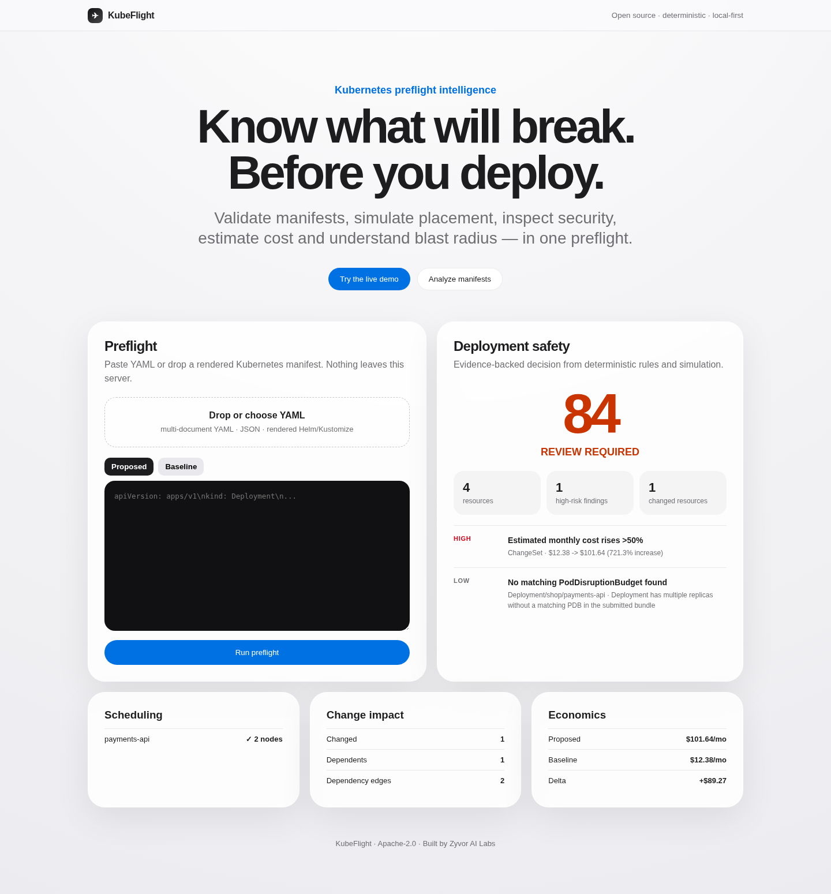

# KubeFlight

**Know what may break before you deploy.**

KubeFlight is an Apache-2.0, local-first Kubernetes deployment simulator and preflight engine from Zyvor AI Labs. It analyzes rendered manifests, optionally compares them with a baseline and a target-cluster snapshot, simulates placement, evaluates security/RBAC/network policy, estimates change cost, and returns an evidence-backed safety decision.



> KubeFlight is intentionally deterministic. It does not use an LLM to decide whether a deployment is safe.

## Why it exists

A valid manifest can still fail in production because of node capacity, existing Pods, taints, affinity, NetworkPolicy, missing RBAC, removed APIs, cost growth, availability constraints, or downstream dependencies. KubeFlight puts those signals into one repeatable preflight.

## v0.2.0 capabilities

| Area | Checks |
| --- | --- |
| Parsing/rendering | multi-document YAML/JSON, Kubernetes `List`, Helm auto-render, Kustomize auto-render, repo path auto-detection |
| Schema baseline | object identity, common workload structural checks, selector/template consistency, removed APIs; optional authoritative `kubectl --dry-run=server` |
| Quantities | Kubernetes-style DecimalSI/BinarySI/scientific quantities; invalid quantities fail closed instead of becoming zero |
| Restricted security | host namespaces, hostPath, privileged, privilege escalation, capabilities, seccomp, non-root/UID 0, SELinux, AppArmor, safe sysctls, Windows HostProcess, probe/lifecycle host fields |
| Scheduling | existing Pod reservations, every replica, app/init/native-sidecar accounting, RuntimeClass overhead, ephemeral storage, GPU/extended resources, Ready/unschedulable nodes, selectors, taints/tolerations, required node affinity, required pod affinity/anti-affinity, hard topology spread |
| Reliability | requests/limits, readiness/liveness, PDB coverage, image pinning |
| Network | statically inferred Service dependencies, ingress + egress NetworkPolicy isolation, selectors/matchExpressions, ports/endPort/named ports, namespaces |
| RBAC | ServiceAccount presence plus explicit API group/resource/subresource/verb/resourceName contracts via annotation |
| Change impact | baseline/proposed resource diff, baseline + proposed dependency graphs, deletion-aware reverse blast radius |
| Cost | provider-neutral request/storage estimate and baseline delta |
| Reports | text, JSON, HTML, Markdown/PR summary, SARIF |
| API/UI | FastAPI REST API, OpenAPI docs, Apple-inspired embedded dashboard, request-size/concurrency/rate guards, optional bearer auth |
| Kubernetes | hardened raw manifests, Kustomize, Helm, opt-in live-cluster RBAC, restricted Pod Security namespace |
| GitHub | composite Action, SARIF upload support, Helm/Kustomize checks, container build, kind E2E, multi-arch release, SBOM/provenance wiring |

KubeFlight is a **preflight simulator**, not a byte-for-byte implementation of kube-scheduler plugins, admission webhooks, CNI dataplanes, or production traffic. Unknown facts are reported conservatively rather than invented.

## Quick start

```bash
python -m venv .venv
source .venv/bin/activate
pip install -e .

kubeflight check examples/demo/app.yaml \
  --baseline examples/demo/baseline.yaml \
  --cluster-snapshot examples/demo/cluster-snapshot.json \
  --fail-on never
```

Or let KubeFlight auto-detect a conventional Kubernetes/Helm/Kustomize path:

```bash
kubeflight plan
```

Generate reports:

```bash
kubeflight check deploy/rendered --format json --output report.json --fail-on never
kubeflight check deploy/rendered --format html --output report.html --fail-on never
kubeflight check deploy/rendered --format markdown --output summary.md --fail-on never
kubeflight check deploy/rendered --format sarif --output kubeflight.sarif --fail-on never
```

Optional authoritative API-server validation:

```bash
kubeflight check deploy/rendered --server-dry-run
```

This shells out to `kubectl apply --dry-run=server`; it requires a configured cluster and is deliberately opt-in.

## Dashboard

```bash
kubeflight serve --host 0.0.0.0 --port 8080
```

Open `http://localhost:8080`. API docs are at `/api/docs`.

The browser sends manifests to the KubeFlight instance you opened. KubeFlight itself makes no external SaaS or AI call. Do not send Secrets to an untrusted/shared deployment.

## Remote deploy

Cross-ships source and installs KubeFlight as a systemd service over SSH (same pattern as Kairo/Scout):

```bash
# Explicit port (CLI flag)
./scripts/deploy-remote.sh 212.8.248.187 sus --port 27754

# Or via env
KUBEFLIGHT_PORT=27754 ./scripts/deploy-remote.sh 212.8.248.187 sus

# Omit port → reuse .deploy-last PORT, else pick random 18000–28999
./scripts/deploy-remote.sh 212.8.248.187 sus

# Smoke (URL, --port, env, or .deploy-last)
KUBEFLIGHT_URL=http://212.8.248.187:27754 ./scripts/smoke-remote.sh
./scripts/smoke-remote.sh --port 27754

# Remove
./scripts/deploy-remote.sh 212.8.248.187 sus --uninstall
```

## Docker

```bash
docker build -t kubeflight:local .
docker run --rm -p 8080:8080 --read-only --cap-drop ALL kubeflight:local
```

## Kubernetes

Default mode has **no service-account token** and no cluster-wide RBAC:

```bash
kubectl apply -k deploy/kubernetes
kubectl -n kubeflight rollout status deployment/kubeflight
kubectl -n kubeflight port-forward service/kubeflight 8080:80
```

The namespace pins Pod Security Admission to `restricted:v1.37` and the container runs non-root, drops all Linux capabilities, uses `RuntimeDefault` seccomp and a read-only root filesystem.

### Opt-in live-cluster snapshot mode

Live mode is intentionally separate because it lets KubeFlight read cluster metadata. Create an API token Secret first:

```bash
kubectl -n kubeflight create secret generic kubeflight-api \
  --from-literal=token='replace-with-a-long-random-token'

kubectl apply -k deploy/kubernetes/live-cluster
```

The live overlay grants read-only `get/list` for Nodes, Namespaces, Pods, ServiceAccounts, StorageClasses and RuntimeClasses. It does **not** grant Secrets, logs, exec, mutation, or workload write permissions. Clients must authenticate to `/api/check` with `Authorization: Bearer <token>` when live mode is enabled.

### Helm

Default/offline mode:

```bash
helm upgrade --install kubeflight charts/kubeflight \
  --namespace kubeflight --create-namespace
```

Live mode:

```bash
kubectl -n kubeflight create secret generic kubeflight-api --from-literal=token='...'
helm upgrade --install kubeflight charts/kubeflight -n kubeflight \
  --set liveCluster.enabled=true \
  --set liveCluster.existingSecret=kubeflight-api
```

## Offline cluster snapshot

The scheduler accepts a JSON snapshot containing standard Kubernetes objects:

```json
{
  "nodes": [],
  "pods": [],
  "namespaces": [],
  "serviceaccounts": [],
  "storageclasses": [],
  "runtimeclasses": []
}
```

Existing non-terminal Pods with `spec.nodeName` are deducted from node allocatable resources before proposed replicas are placed.

## RBAC contracts

Legacy compact syntax remains supported:

```yaml
metadata:
  annotations:
    kubeflight.io/requires-rbac: "secrets:get,leases:update"
```

For precise checks, use a YAML list inside the annotation:

```yaml
metadata:
  annotations:
    kubeflight.io/requires-rbac: |
      - apiGroup: ""
        resource: secrets
        verbs: [get]
        resourceNames: [payments-db]
      - apiGroup: coordination.k8s.io
        resource: leases
        verbs: [get, create, update]
```

KubeFlight evaluates submitted Roles, ClusterRoles, RoleBindings and ClusterRoleBindings.

## GitHub Action

```yaml
name: KubeFlight
on: [pull_request]
permissions:
  contents: read
  security-events: write
jobs:
  preflight:
    runs-on: ubuntu-latest
    steps:
    - uses: actions/checkout@v4
    - uses: zyvorai/kubeflight@v0.2.0
      with:
        path: deploy/rendered
        baseline: deploy/baseline
        fail-on: high
    - uses: github/codeql-action/upload-sarif@v3
      if: always()
      with:
        sarif_file: kubeflight.sarif
```

The action also appends a human-readable Markdown summary to the GitHub Actions step summary.

Exit codes:

- `0`: analysis completed and configured severity threshold was not crossed
- `2`: input/parser/snapshot error
- `3`: finding threshold crossed
- `4`: optional server-side dry-run could not complete

## Cost model

Defaults are normalized reference rates, not a cloud bill forecast:

```bash
export KUBEFLIGHT_COST_CPU_MONTH=14.60
export KUBEFLIGHT_COST_GIB_MONTH=1.90
export KUBEFLIGHT_COST_GIB_STORAGE_MONTH=0.08
export KUBEFLIGHT_COST_GPU_MONTH=510
```

Calibrate these values to your provider/on-premises accounting before using cost gates.

## API security

Useful server environment variables:

```text
KUBEFLIGHT_API_TOKEN              optional bearer authentication
KUBEFLIGHT_LIVE_CLUSTER=false     live cluster reads are disabled by default
KUBEFLIGHT_MAX_BODY_BYTES=4194304
KUBEFLIGHT_MAX_CONCURRENT=8
KUBEFLIGHT_RATE_PER_MINUTE=60
```

Live-cluster requests require both `KUBEFLIGHT_LIVE_CLUSTER=true` and `KUBEFLIGHT_API_TOKEN`.

## Development and release checks

```bash
pip install -r requirements-dev.txt
./scripts/release_check.sh
```

The local release check runs compile, tests, API smoke, Kubernetes self-analysis, YAML metadata validation, wheel build, and clean installed-package smoke. CI adds Helm, Kustomize, Docker and kind checks because those binaries are not guaranteed to exist on developer machines.

## Project layout

```text
kubeflight/
├── kubeflight/             # parser, deterministic engine, API, CLI, embedded UI
├── tests/                  # unit/API/CLI + v0.2 regression tests
├── examples/               # demo + intentionally unsafe manifests
├── deploy/kubernetes/      # restricted default install + opt-in live overlay
├── charts/kubeflight/      # Helm chart
├── scripts/                # smoke/self-analysis/release checks
├── docs/                   # architecture, rules, deployment, threat model
├── action.yml              # GitHub composite action
└── .github/workflows/      # CI, kind E2E, release/SBOM/provenance
```

## Design principles

1. Deterministic first.
2. Evidence and remediation with every finding.
3. Local-first; no SaaS dependency.
4. No cluster credentials in the default deployment.
5. Unknown is not the same as safe or blocked.
6. Server dry-run/admission remains authoritative when enabled.
7. Simulation limitations are part of the output contract.

## Security

See [SECURITY.md](SECURITY.md) and [docs/THREAT_MODEL.md](docs/THREAT_MODEL.md).

## License

Apache License 2.0. See [LICENSE](LICENSE).
